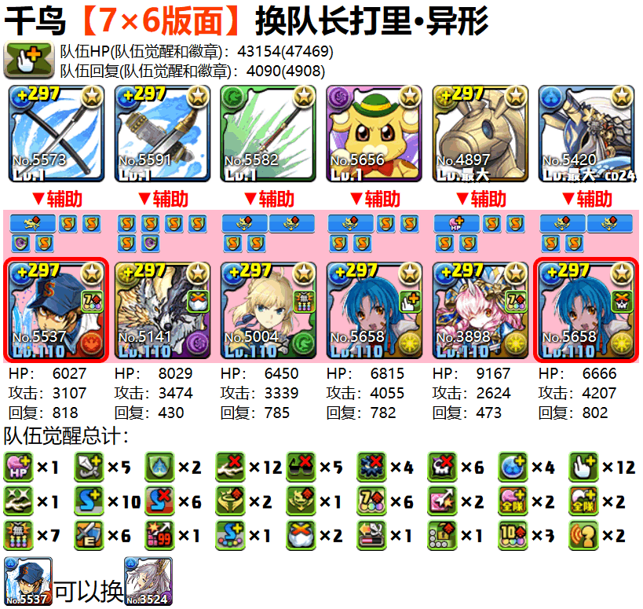
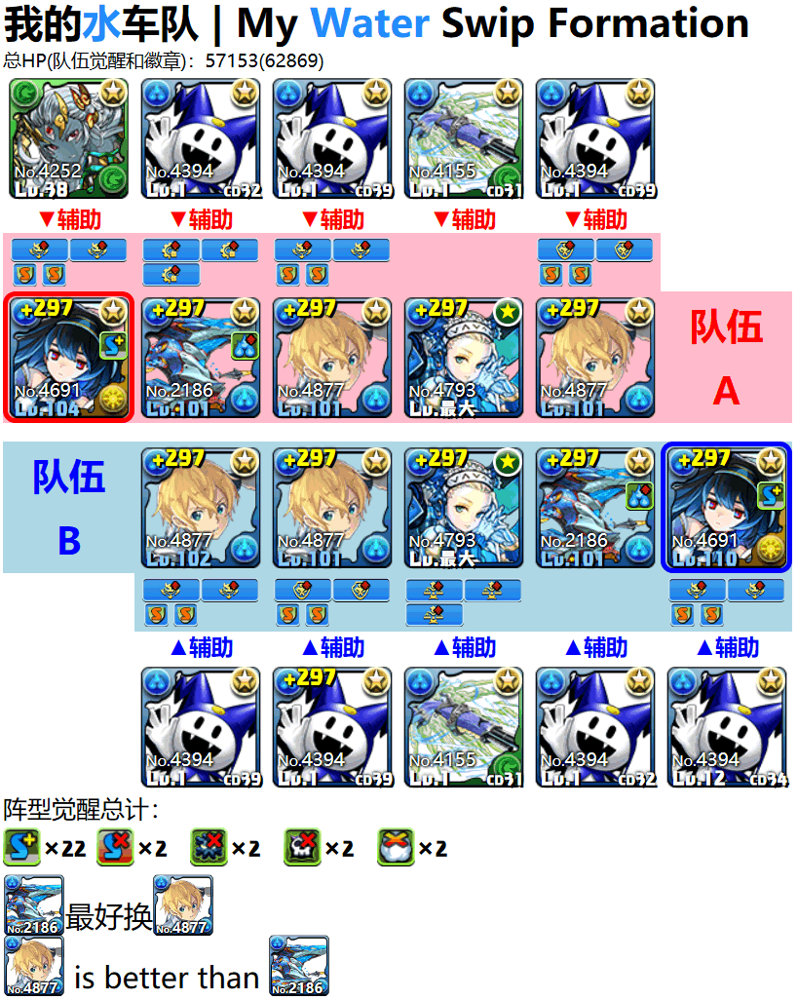
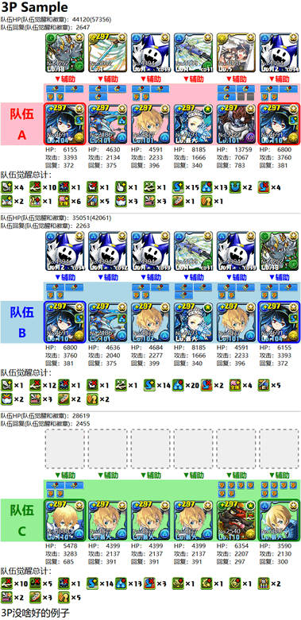

智龙急速阵型 | P&D Dash Formation
======
这是一个智龙迷城队伍图制作工具。  
This is a Puzzle & Dragons Formation Maker.

这个工具可以帮助你方便的制作和分享车队阵型或单人队形。电脑、智能手机上都可以轻松使用。   
This tool can help you easily create and share Swipe Formation or Solo Formation. Easy to use on your PC and Smart Phone.

### 预览 | Preview

| **单人 \| Solo** | **2人协力 \| 2P** |
| :---: | :---: |
|  |  |
| **3人协力 \| 3P** | **手机 \| Mobile**  |
|  |  |

# 如何使用 | HOW TO USE
推荐[火狐浏览器](https://www.mozilla.org/firefox/new/) | [Firefox](https://www.mozilla.org/firefox/new/) is recommended
## 快速使用在线版（推荐） | Online Quick Start (Recommended)
* <https://mapaler.github.io/PADDashFormation/> (Github Pages)
* <https://mapaler.com/PADDashFormation/> (我自己的镜像 | my own mirror)
> *Gitee* 的镜像已经停止更新。  
> The mirror of *Gitee* has stopped updating.

## 创建你自己的镜像网站 | Create your own mirror web site
`git clone`到你的 *http* 服务目录即可访问，将来更新时只需要`git pull`即可。  
`git clone` to your *http* service directory for visited, and `git pull` for future updates.

## 下载后使用本地版 | Use the local version after downloaded
[下载压缩包](archive/refs/heads/master.zip)或`git clone`后使用浏览器打开`index.html`。  
[Download ZIP](archive/refs/heads/master.zip) or `git clone`, and open the `index.html` with Browser.
* 火狐68.0及以后需要在`about:config`设定`privacy.file_unique_origin`为`false`。  
Firefox 68.0 or above need setting the `privacy.file_unique_origin` to `false` in `about:config`.
* Chrome需要添加`--allow-file-access-from-files`启动参数。  
Chrome browser need start with the additional argument `--allow-file-access-from-files`.

# [帮助和提示 | Help and Tips](help.md)

# 翻译我 | Translate me
## 目前支持的语言 | Languages currently supported
1. 中文（简体）
1. 中文（繁體）
1. English
1. 日本語 (by Bing Microsoft Translator)
1. 한국어 (by Bing Microsoft Translator)

## How to **Pull requests**
1. Click **Fork** In the page top right corner. Fork your own copy of this repository to your account.
1. Use Git to clone/pull repository locally for modification (How to modify please see below).
1. Use Git to commit and push changes to your repository on GitHub.
1. Go to the **[Pull requests](../../pulls)** page in the top middle of this repository, and click the **New pull request** button.
1. Click the **Compare Across Forks** button and select your fork, the page then displays the changes.
1. Click the **Create pull request** button and enter the details of the modification, create your pull request.

## Translate
1. Go to the `languages` folder
1. Push your language info into `language-list.js`.  
This is an Object for a language list item.
    ```js
    {
      name: "English",
      i18n: "en",
      i18n_RegExp: /^en/i,
      searchlist: ["en","ja"],
      guideURL: id=>`http://www.puzzledragonx.com/en/monster.asp?n=${id}`
    }
    ```
    * `name` is the showed name in the list.
    * `i18n` is the language-tag for your language. You need to make sure that the file names are the same.
    * `i18n_RegExp` is a *Regular Expressions* to match multiple `navigator.language` (like `/^en/i` can match `en-US`, `en-CA` and `en-AU`).
    * `searchlist` is the search candidate list string order when you search monster in edit window.  
    Currently only `ja`,`en`,`ko`,`cht`,`chs` languages.(See [monsters-info](monsters-info))
    * `guideURL` is a **Function(cardId,cardName)** to return game guide URL for your language.
      ```js
      //Full writing
      guideURL:function(cardId,cardName)
      {
        return "http://sample.com/pad/search.php?id=" + cardId + "&name=" + cardName;
      }

      //In ES6 be equivalent to
      guideURL:(cardId,cardName)=>`http://sample.com/pad/search.php?id=${cardId}&name=${cardName}`

      //If you only need cardId, can write to
      guideURL:cardId=>`http://sample.com/pad/search.php?id=${cardId}`
      ```
1. Create your language's Localisation file `[i18n].css` and `[i18n].js`.  
Please refer to existing files.

# 权利归属 | Copyright
> 本软件灵感来源于[PDC 智龙迷城伤害计算器](//play.google.com/store/apps/details?id=com.corombo13.paddamagecal)  
> This software is inspired by [PDC パズドラダメージ計算](//play.google.com/store/apps/details?id=com.corombo13.paddamagecal)

> © GungHo Online Entertainment Inc. All Cards Images && Info Right Reserved.  
> 所有图片素材版权与怪物信息归属于GungHo在线娱乐有限公司。  
> パズル&ドラゴンズに関する画像及び情報等の権利はGungHo Online Entertainment Inc.に帰属します。
> ### 智龙迷城官网 | Puzzle & Dragons Official Website
> * [パズル＆ドラゴンズ](http://pad.gungho.jp)
> * [龍族拼圖](https://pad.gungho.jp/hktw/pad/)
> * [Puzzle & Dragons](https://www.puzzleanddragons.us/)
> * [퍼즐앤드래곤](https://pad.neocyon.com/W/)

> © Fontworks Inc. Font Kurokane Right Reserved.
> くろかね字体版权归属于Fontworks有限公司。  
> [くろかね書体](https://fontworks.co.jp/fontsearch/kurokanestd-eb/)の権利は フォントワークス株式会社 に帰属します。

> 卡片中文名、中文分类来自于[Puzzle & Dragons 戰友系統及資訊網](https://pad.skyozora.com/)

# 使用开源软件 | Open source software used
* [Puzzle-and-Dragons-Texture-Tool](//github.com/codywatts/Puzzle-and-Dragons-Texture-Tool) //Extract Images
* [pad-rikuu](//github.com/kiootic/pad-rikuu) //Parse data
* [zxing-js](//github.com/zxing-js/library) //Read, Write QR Code
* [html2canvas](//github.com/niklasvh/html2canvas) //Capture Image
* [aaa](//github.com/jy4340132/aaa) //Play voice(ADPCM wav)
* [Font Awesome Free](https://github.com/FortAwesome/Font-Awesome) //Font Icon
* [Zpix (最像素)](//github.com/SolidZORO/zpix-pixel-font) //Pixel Font
* [font-spider](//github.com/aui/font-spider) //Compression Font file