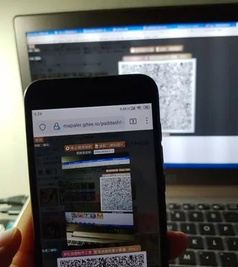
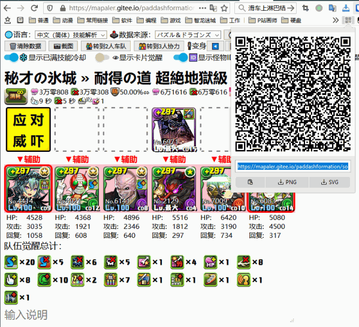
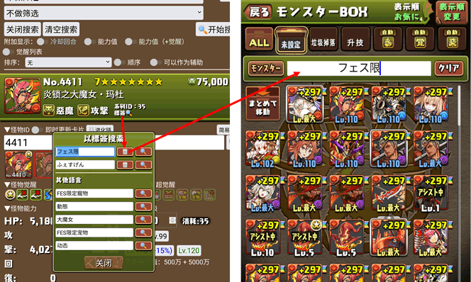

智龙迷城队伍图制作工具使用技巧 Tips of *Puzzle & Dragons Formation Maker*
======
## 目录 | Index
* [分享队伍 | Share your team](#分享--share)
* [队伍编辑技巧 | Convenient tips for edit](#编辑技巧--editing-tips)
* [搜索图鉴 | Search cards](#搜索图鉴--search-cards)
* [文字说明的高级功能 | Advanced of the description](#文字的高级功能--advanced-of-text-detail)
* [其他 | Others](#其他--others)
* [报告BUG | Report BUG](#报告bug--report-bug)

## 分享 | Share
### 通过网址分享和收藏队伍 | Share and collect teams by URL
直接复制网址即可分享组队或自己添加收藏夹保存。  
Copy the URL directly to share the Formation, or add a Bookmark to collect.  
  
为了更方便的分享，你可以使用任意第三方*短网址服务*进一步缩短网址。   
For easier sharing, you can further shorten your URL using any third-party *Short URL Service*. Like, [bitly](https://bitly.com/).
### 二维码分享 | Share by QR Code
可以使用摄像头读取队伍二维码  
You can use the camera to read the Formation QR code  
  
读取到的队伍会显示为链接  
The read Formation appears as a link  
  
目前可以读取 | Currently can read:
  1. 本程序自有格式的二维码  
  This program's own format QR code  
  
  1. 使用浏览器扩展生成本程序组队网址链接的二维码  
  QR code of this program Formation URL which generated by browser extension.  
  
  1. PDC 的二维码  
  PDC format QR code  
  

## 编辑技巧 | Editing tips
* 使用**后退**即可撤销上一次修改，需要重做则使用前进。  
Use **Back** to undo the last edit, redo with Forward.  

* **拖拽**卡片头像即可快速交换位置，也支持手机触屏。  
**Drag** card avatars to quickly swap member's positions, also supports mobile touch screen.  
  
使用顶部的开关可以切换到复制模式  
Use the switch at the top can switch to copy mode.
* 如果你希望使用技能切换队长，使用切换按钮。这样可以保留原始队长强调边框，和76版面图标。  
If you want switch leader by skill, use the switch button. This preserves the original leader accent border, and the 76 board icon.  

* 使用`Ctrl + ←/→`，或小键盘上的`←/→`(需关闭`NumLock`)可以快速切换变身。  
You can using `Ctrl + ←/→` or `←/→` on keypad (turn `NumLock` off) to quickly change Henshin.  

## 搜索图鉴 | Search cards
* 可以在编辑界面的怪物ID输入**怪物名称**或**标签**来搜索卡片。  
You can search for card by entering the **Monster Name** or **Tags** in the monster ID of the editing interface.  
  
* 点击**技能名称**，可搜索相同主动技能宠物  
Click on **Skill Name** to search for the same active skills Cards.  
  
* 点击**系列ID**或**标签**，可搜索该系列  
Click the **Series ID** or **Tags** to search for series.  
  
* 复制本版本游戏数据的**标签**，可在游戏中搜索系列名称  
Copy the **Tag** of this version of the game data can search for the series in the game.  
  
* 点击编辑界面的卡片头像可以跳转到攻略网站。  
Click on the card avatar in the editing interface to jump to the Guide.  
  
在队伍界面和搜索结果的怪物头像上，点击鼠标中键也可以跳转到攻略网站。在手机上则是长按怪物头像然后选择在新标签页打开。  
Or click the middle mouse button on the monster avatar of the formation interface and search results to jump to the Guide. On your phone, you're long-pressing the monster avatar and then selecting to open it in a new tab.  

## 文字的高级功能 | Advanced of text detail
* 队伍标题与队伍说明可以使用`^16进制颜色代码^内容^p`来改变内容颜色；  
Formation Title and Detail can use the `^[Hex Color Code]^Content^p` to change the color of the Content.  
  
`%{m怪物ID}`可以显示怪物头像。  
`%{m[Monster ID]}` can display the monster avatar.  

## 其他 | Others
* 2人只显示部分共用的觉醒的统计（不包括超觉醒），单人和三人则全部显示。  
The 2P Multi Games Mode shows only several common awoken statistics (excluding super-awakening), but the Solo and 3P Mode shows all.
* 内建的截图按钮依靠 [html2canvas](https://github.com/niklasvh/html2canvas/)，会有一些绘制错误，浏览器的截图扩展能够更加还原显示的真实样子。  
Built-in screenshot button relies on [html2canvas](https://github.com/niklasvh/html2canvas/), there will be some drawing errors, browser screenshot extension can be more restore the real appearance of the display.
* 如果你只是希望将本程序当作简单图鉴使用，可以在参数里加上`guide=1`，如`http://mapaler.gitee.io/paddashformation/solo.html?guide=1`。图鉴模式下进入网页时，会直接打开怪物修改界面，并且背景不透明。  
If you just want to use this program as a simple guide, you can add `guide=1` to the parameters, such as `https://mapaler.github.io/PADDashFormation/solo.html?guide=1`. When you enter the page in guide mode, the monster modification interface opens directly and the background is opaque.

## 报告BUG | Report BUG
如果发现 BUG，请先按 Ctrl+F5 强制刷新，并点击数据更新时间按钮强制更新数据。如仍存在问题可以在 [Issues](//github.com/Mapaler/PADDashFormation/issues) 报告。  
If a BUG is found, first test again after force refresh by Ctrl-F5, then click the Data Update Time button to force update the data. If there is still a problem, you can report it at the [Issues](//github.com/Mapaler/PADDashFormation/issues).