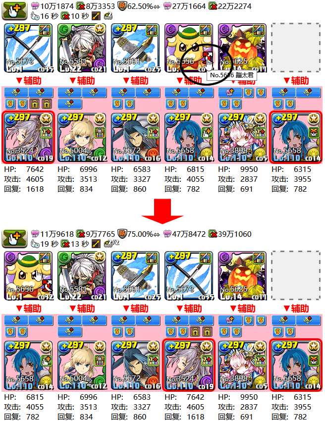
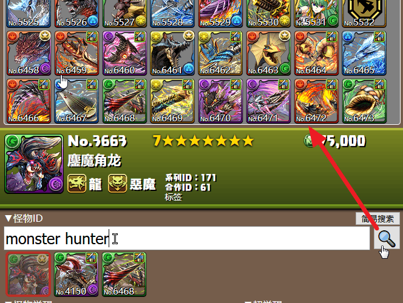
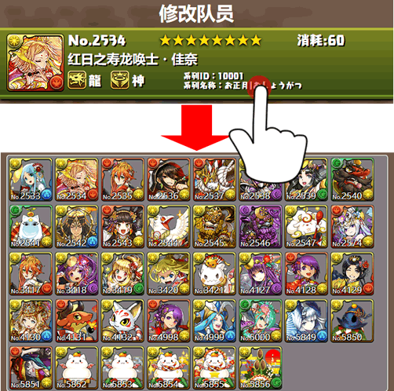
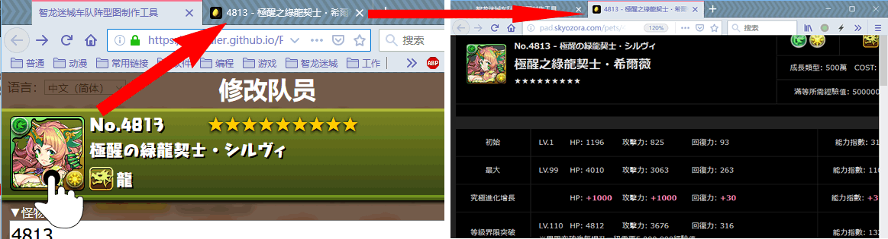
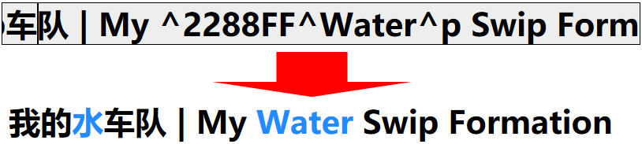
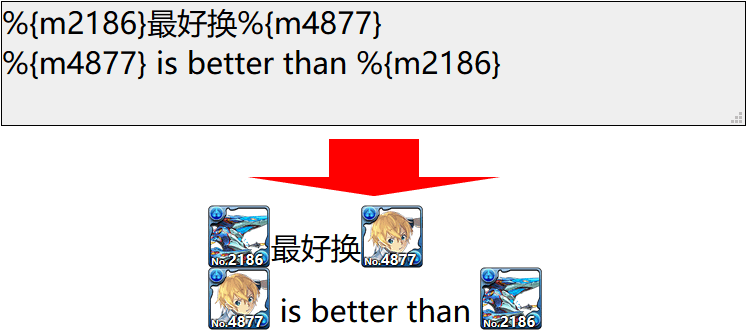

智龙迷城队伍图制作工具帮助 Help of *Puzzle & Dragons Formation Maker*
======
* 直接复制网址即可分享组队或自己添加收藏夹保存。你可以使用*短网址服务*进一步缩短网址。  
Copy the URL directly to share the Formation, or add a Bookmark to archives. You can use any *Short URL Service* to further shorten the URL.  
  
你也可以使用浏览器扩展生成二维码来分享网址。  
You can also share the URL in QR code by browser extensions.  

* 使用后退即可撤销上一次修改。  
Use back to undo the last edit.  

* 拖拽怪物头像即可快速交换位置或复制怪物，也支持手机触屏。  
Drag monster avatars to quickly swap positions or copy monster, also supports mobile touch screen.  

* 如果你希望使用技能切换队长，使用切换按钮。这样可以保留原始队长强调边框，和76版面图标。  
If you want switch leader by skill, use the switch button. This preserves the original leader accent border, and the 76 board icon.  

* 可以在编辑界面的怪物ID输入**怪物名称**或**标签**来搜索怪物。（键入回车以执行）  
You can search for monsters by entering the **Monster Name** or **Tags** in the monster ID of the editing interface.(Type Enter to execute)  
  
点击**系列ID**或**标签**，可搜索该系列  
Clisk the **Series ID** or **Tags** to search for series.  
  
* 点击编辑界面的怪物头像可以跳转到攻略网站。  
Click on the monster avatar in the editing interface to jump to the Guide.  
  
在队伍界面和搜索结果的怪物头像上，点击鼠标中键也可以跳转到攻略网站。在手机上则是长按怪物头像然后选择在新标签页打开。  
Or click the middle mouse button on the monster avatar of the formation interface and search results to jump to the Guide. On your phone, you're long-pressing the monster avatar and then selecting to open it in a new tab.  

* 队伍标题与队伍说明可以使用`^16进制颜色代码^内容^p`来改变内容颜色；  
Formation Title and Detail can use the `^[Hex Color Code]^Content^p` to change the color of the Content.  
  
`%{m怪物ID}`可以显示怪物头像。  
`%{m[Monster ID]}` can display the monster avatar.  

* 2人只显示部分共用的觉醒的统计（不包括超觉醒），单人和三人则全部显示。  
The 2P Multi Games Mode shows only several common awoken statistics (excluding super-awakening), but the Solo and 3P Mode shows all.
* 内建的截图按钮依靠 [html2canvas](https://github.com/niklasvh/html2canvas/)，会有一些绘制错误，浏览器的截图扩展能够更加还原显示的真实样子。  
Built-in screenshot button relies on [html2canvas](https://github.com/niklasvh/html2canvas/), there will be some drawing errors, browser screenshot extension can be more restore the real appearance of the display.
* 如果你只是希望将本程序当作简单图鉴使用，可以在参数里加上`guide=1`，如`http://mapaler.gitee.io/paddashformation/solo.html?guide=1`。图鉴模式下进入网页时，会直接打开怪物修改界面，并且背景不透明。  
If you just want to use this program as a simple guide, you can add `guide=1` to the parameters, such as `https://mapaler.github.io/PADDashFormation/solo.html?guide=1`. When you enter the page in guide mode, the monster modification interface opens directly and the background is opaque.

## 报告BUG | Report BUG
如果发现 BUG，请先按 Ctrl+F5 强制刷新后测试，如仍有问题可以在 [Issues](//github.com/Mapaler/PADDashFormation/issues) 报告。  
If a BUG is found, first test again after force refresh by Ctrl-F5, if there is still a problem, you can report it at the [Issues](//github.com/Mapaler/PADDashFormation/issues).